# KPI Engine — architecture and runtime flow

How a host request becomes JSON: which process owns which step, **what each file contributes**, and how the catalog (ops, hooks, functions) lets the system scale without forking the pipeline.

This is the **how it runs** document. Locked product decisions live in [kpi-framework-plan.md](kpi-framework-plan.md). YAML authoring lives in [kpi-yaml-ai-prep.md](kpi-yaml-ai-prep.md) / [kpi-yaml-reference.md](kpi-yaml-reference.md). Onboarding playbook: [kpi-onboarding-guide.md](kpi-onboarding-guide.md).

---

## 1. What this system is

The KPI Engine is an **in-process Python library**, not a service. The existing metadata platform builds a **context JSON**, calls `kpi_engine.main` (or `compute`), and receives a **JSON payload** of table rows plus optional trend arrays.

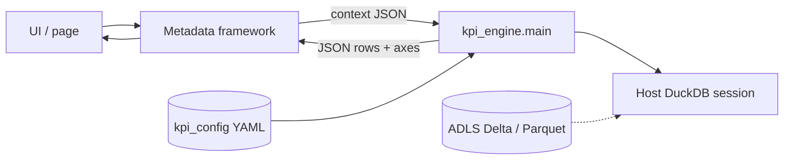

**This engine owns:** resolve KPI + model YAML, claim the time selection, compile and run a DuckDB retrieve, calculate measures in Pandas, paginate, return JSON.

**This engine does not own:** building the context, ADLS credentials, authentication, hierarchy expansion (`heir`), or Databricks jobs. It never closes a host DuckDB connection.

---

## 2. Layers and ownership

Three layers. A new *KPI* is YAML. A new *reusable name* (op, hook, function) is `capabilities/` + `registries/`. A new *engine behavior* (agg, filter operator, time format, common YAML field) is `pipeline/`.

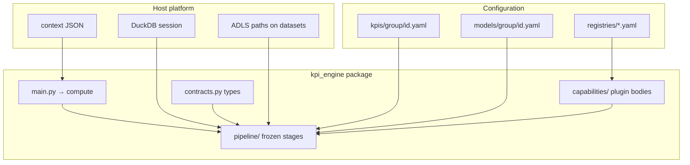

| Layer | Lives in | Changes when |
|---|---|---|
| Host envelope | Context JSON | Metadata / UI request shape |
| Extract | `kpi_config/models/` | Tables, joins, or SQL CTE |
| Calculation | `kpi_config/kpis/` | Time, dims, facts, cuts, `measure_key`s |
| Plugin body | `kpi_engine/capabilities/` | New op / fn / hook implementation |
| Allowlist | `kpi_engine/registries/` | A name becomes callable |
| Frozen pipeline | `kpi_engine/pipeline/` | Stage order, SQL compile, spine, dispatch |
| Shared types | `kpi_engine/contracts.py` | New locked YAML/context field |

---

## 3. Public entry and process start

```text
Host UDF  →  kpi_engine.main.main(context, connection=…)
         →  kpi_engine.compute(context, connection=…)
         →  pipeline.orchestrator._compute(…)
```

`validate(context)` is the same path through **compile SQL**, with no file scan.

On first import of `kpi_engine`:

1. `_bootstrap.ensure_parent_on_path()` — parent of `kpi_engine/` on `sys.path` (never the package folder itself; that would shadow Hub `core` / `pipeline`).
2. `pipeline.loader.ensure_loaded()` — reads `registries/ops.yaml`, `hooks.yaml`, `functions/column.yaml`, `functions/measure.yaml` and registers Python classes from `capabilities/`.

Config root (first match): `config_dir=` argument → env `KPI_ENGINE_CONFIG_DIR` → sibling `kpi_config/` next to the package.

DuckDB session (first match): `connection=` argument → `register_duckdb_getter` / `HOST_DUCKDB_GETTER` / env `KPI_ENGINE_DUCKDB_GETTER` → local `duckdb.connect()` (tests only; engine **closes** only that owned fallback).

---

## 4. End-to-end `compute()` sequence

Every request follows this order. There is no per-`kpi_id` branch in Python.

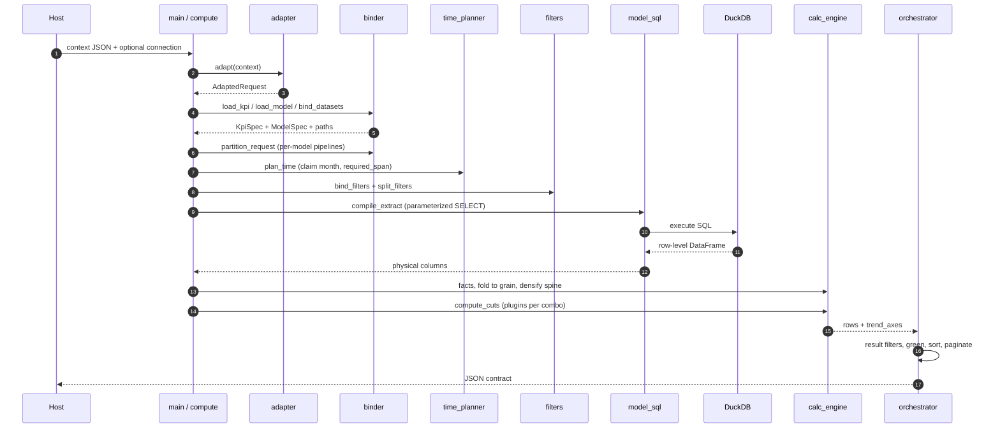

Module map for the same steps:

| Step | Function | File |
|---|---|---|
| Parse context | `adapt` | `pipeline/adapter.py` |
| Load YAML | `load_kpi`, `load_model` | `pipeline/binder.py` |
| Parameter overlay | `bind_incoming`, `apply_request_time` | `pipeline/parameters.py` |
| Measure graph | `resolve_requested_graph` | `pipeline/binder.py` |
| Split extracts | `partition_request` | `pipeline/pipelines.py` |
| Bind aliases | `bind_datasets` | `pipeline/binder.py` |
| Time selection | `plan_time`, probe | `pipeline/time_planner.py` |
| Filter bind/split | `bind_filters`, `split_filters` | `pipeline/filters.py` |
| Compile + run SQL | `compile_extract`, `extract` | `pipeline/model_sql.py` |
| Row facts / fold | `apply_pandas_facts`, `collapse_pandas_detail` | `pipeline/fn_apply.py`, `row_pipeline.py` |
| Multi-model join | `join_monthly` | `pipeline/relations.py` |
| Dense calendar | `densify` | `pipeline/calc_engine.py` |
| Cuts + ops | `compute_cuts`, `evaluate` | `pipeline/calc_engine.py` |
| Plugin body | `OpPlugin.evaluate` / `apply_to_cut` | `capabilities/ops/` |
| JSON envelope | `_compute` tail | `pipeline/orchestrator.py` |

Per-file contribution at each step: **§19**. How ops / hooks / functions scale without touching `pipeline/`: **§20–§21**.

---

## 5. Host context (what arrives)

The adapter requires `execution.kpi_id` and **exactly one** `view_details` entry. `business_date` is ignored. `execution.time_grain` is rejected (grain belongs on `parameters.time_grain`).

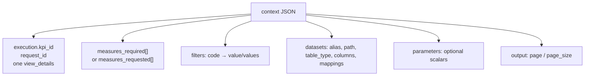

Typical shape (tests build this in `tests/conftest.py` `make_context`):

- `execution.kpi_id` → filename stem of `kpi_config/kpis/<group>/<kpi_id>.yaml` (exact match).
- `measures_required` → `measure_key`s that must exist under YAML `measures:`. Empty list computes nothing. Omitted list can fall back to YAML `meta.selected_metrics`.
- `filters` — each code has `value` or `values` (normalized to a list, default operator IN). `input_text: heir` is rejected.
- `datasets` — bind by **alias**, then by datasets key. Context **path** wins; model `default_path` fills a missing alias. YAML never stores ADLS URIs for the retrieve.

---

## 6. Bind: two YAML files, one typed spec

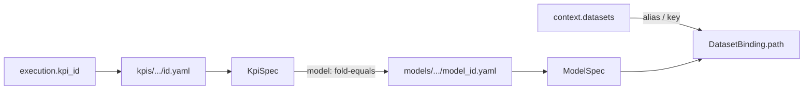

**KPI YAML** is math and grain: `time`, `dimensions`, `base_measures`, `cuts`, `measures`.  
**Model YAML** is retrieve: `kind: physical` (scans + joins) or `kind: sql` (CTE wrapped as a subquery). Prefer `$alias_scan` so Delta vs Parquet follows `table_type`.

Filename rules:

- KPI: stem **exactly** equals `kpi_id` / `execution.kpi_id`. Optional one group folder. Ids unique across groups.
- Model: stem **folds** (case / space / underscore). KPI `model:` must fold-equal `model_id:`. `sotif` ≠ `sotif_sql`.

`resolve_requested_graph` walks each requested `measure_key` to the `base_measures` it needs. Unrequested measures do **not** widen the DuckDB span.

`partition_request` then groups those measures:

- One **pipeline** per extract model when graphs stay on one model.
- One **joined** pipeline when a measure graph spans models (requires YAML `model_relations`; join happens **after** each extract is aggregated).

---

## 7. Time planning (anchor is never a one-month IN)

The selected period is claimed by `plan_time` and **removed** from generic IN filters. Lookback widens the scan; calculation collapses back to the anchor.

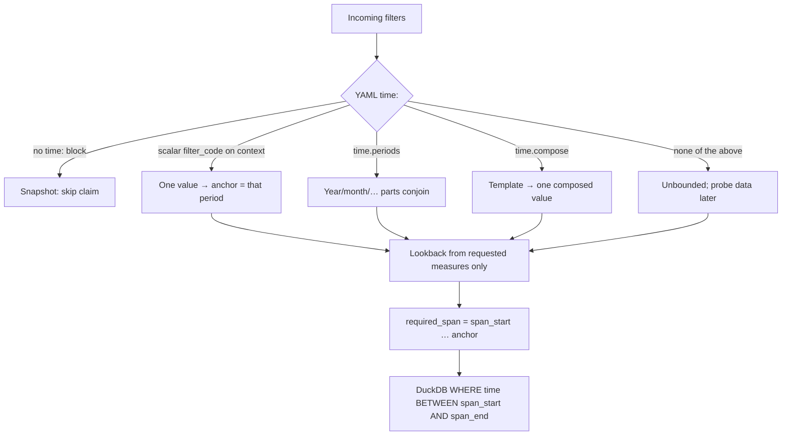

Rules that matter at runtime:

- Scalar `filter_code` on the context = exactly one value and **wins**.
- `periods:` parts conjoin; a missing part is not applied; lists = union. Month accepts `3`, `"03"`, `March`, `Mar`.
- `offset` / `trailing` calendar units keep their meaning after a grain pick (`parameters.time_grain`).
- Optional `time.anchor: last_observed` and `time.max_span_years` are opt-in.
- Snapshot KPIs (`time:` omitted): only `point` at offset 0 and `constant`. No window, trend, nonzero offset, or period hooks.

If the plan has no year bound, `_resolve_time_plan` runs a **period probe** SQL (`compile_period_probe`) on the host connection, then fills `anchor` / span from observed dates.

---

## 8. Filters: three stages

After time is claimed, remaining filters bind to columns (`YAML filters:`, dataset `filter_column_mappings`, optional `filter_map`). Unmapped **valued** filters error. Empty / `[]` / all-null skip (`skipped_filters`).

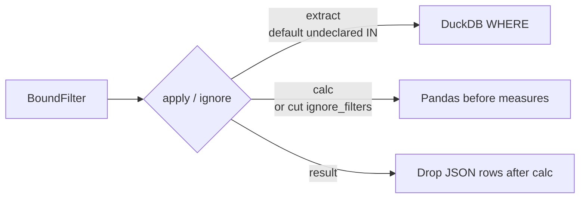

| Stage | When | Effect |
|---|---|---|
| `extract` | Cheap, same for every cut | Predicate in DuckDB `WHERE` |
| `calc` | A cut `ignore_filters` that code, or YAML `apply: calc` | Mask the Pandas frame **per cut** so G can ignore region while R still filters |
| `result` | YAML `apply: result` | Hide rows in JSON; **share / percent_of_total still includes hidden rows** |

Year/month belong in `time:`, not `filters:`. Measure-level `where:` / `ignore_filters:` only apply when `of:` is a **base** (binder clones a filtered fact).

---

## 9. DuckDB extract vs Pandas math

The model answers “what did we query?” Registries answer “what names can we compute?” DuckDB **does not** run KPI `agg:` / `op:` / measure `expr:`.

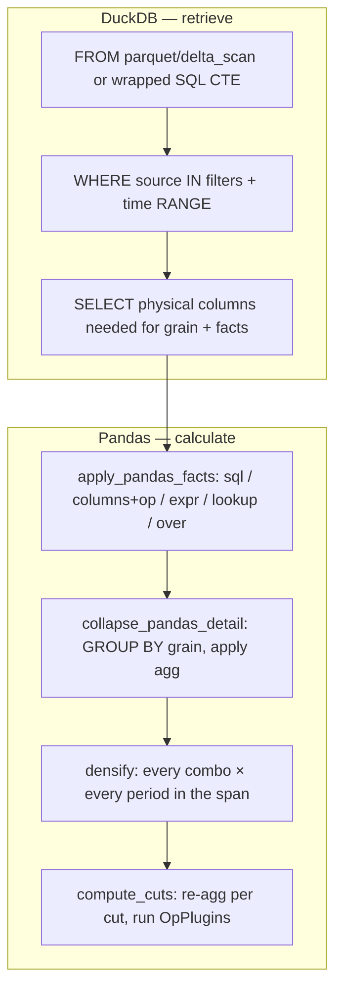

**Physical model.** `read_parquet(?)` or `delta_scan(?)` with the path as a bound parameter. Joins: `inner` / `left` / `right` only.

**SQL model.** Body is wrapped `( inner ) AS model_id`. `$alias_scan` / `$alias_path` become parameters. Context IN + time range wrap the **final SELECT**.

Grain of the retrieve = time column + union of effective cut keys (plus join keys / filter columns that must survive). Additive aggs (`sum`, `count`, `min`, `max`) re-aggregate per cut in Pandas. `avg` is carried as sum+count and divided after re-agg. Non-additive (`count_distinct`, `median`, `percentile`, `first`, `last`, `stddev`, `variance`, `mode`) re-read **row-level detail** per cut.

---

## 10. From extract to monthly spine

`orchestrator._extract_all` for each model in the pipeline:

1. `extract` → raw frame of physical columns.
2. `fold_extract_columns` / `apply_dimension_maps` — align names to YAML dimensions.
3. Global `calc` filters (`apply_frame_filters`).
4. `stabilize_detail` then `apply_pandas_facts` — row helpers (`expr`, `lookup`, `over`) and column ops; then named facts.
5. `collapse_pandas_detail` — fold to extract grain with declared `agg:`.
6. If `joined`: `join_monthly` on `model_relations.on` ∩ (time ∪ grouping).
7. `_to_monthly` → `densify`: cross product of dimension combos × every period from `span_start` through the anchor (plus forward lookback if needed).

Why densify: YoY / trailing-N / lag must move by **calendar**, not by “previous observed row.” Empty `sum`/`count` slots fill `0` up to last observed; other aggs stay null. Grid cap: 50,000 cells (`TREND_CELL_CAP`).

`row_set: span_union` (default) keeps combos seen anywhere in the span. `anchor_only` keeps combos observed at the selected period.

---

## 11. Cuts and measure dispatch

Cuts are **grouping grains**, not measures. Effective grain = `request_grain` − `exclude_from_grain` + extras in `group_by`. `group_by` must not repeat names already in `default_dimensions` / selected dimensions.

Example from KPI 3004: request grain `[reason_code]`, cut G excludes `region` and ignores the region filter, cut R adds `region`. `also_emit: [R]` packs both into one response. Context `parameters.output_cut` is the walk root; YAML `default_cut` does not lock it.

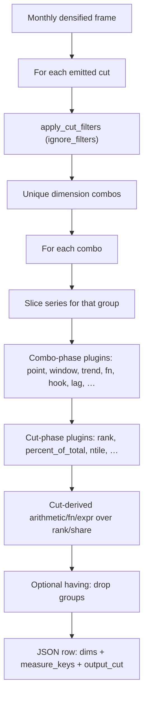

`evaluate` builds an `EvalCtx` and calls `get_op(kind).evaluate(ctx)`. Child measures recurse through the same function with memo `(measure_key, effective_anchor, selection)`. A parent may shift the child’s anchor (`lag` of a ratio, `offset:` on `trend`). Ops with `shiftable = False` cannot run at a shifted anchor.

| Phase | Typical ops | When they run |
|---|---|---|
| Combo | `point`, `window`, `trend`, `arithmetic`, `fn`, `expr`, `hook`, `lag`, `constant` | Per dimension combo, on that group’s time series |
| Cut | `rank`, `percent_of_total`, `ntile`, `dense_rank`, `gap_to_leader`, … | After all combos of the cut exist (needs the full set) |
| Cut-derived | `arithmetic` / `fn` / `expr` whose inputs are cut-phase | After `apply_to_cut` |

Trends, rank, and `percent_of_total` default to `default_cut` unless `measures.*.cuts` lists more. Trend payload is also capped at 50,000 cells per cut.

---

## 12. Capability plugins (how a name becomes code)

A YAML `op: window` is not a string eval. It is an allowlisted class:

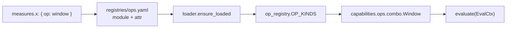

Same pattern for:

| Registry | Body folder | Used by |
|---|---|---|
| `registries/ops.yaml` | `capabilities/ops/` | `measures.op` |
| `registries/hooks.yaml` | `capabilities/hooks/` | `op: hook` |
| `registries/functions/column.yaml` | `capabilities/functions/column/` | `base_measures` `columns:` + `op:` |
| `registries/functions/measure.yaml` | `capabilities/functions/measure/` | `op: fn` / `arithmetic` |

If a name is not in the registry (or `enabled: false`), bind fails. Do not add `if kpi_id == …` in `pipeline/`.

---

## 13. After calculation: envelope JSON

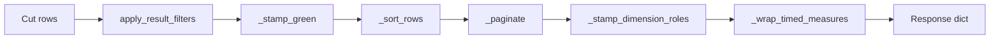

Null `page_size` means return all rows. Sort is deterministic before pagination. Dimension roles and period wrapping run on the page only.

Response fields (see `orchestrator._compute`):

| Field | Meaning |
|---|---|
| `kpi_id`, `request_id` | Echo |
| `rows` | One object per dimension combo per cut; one column per requested `measure_key` |
| `trend_axes` / `trend_labels` | Shared period axis for graph measures |
| `applied_filters` / `ignored_filters` / `skipped_filters` | What ran, what a cut ignored, what had no values |
| `applied_cuts` / `dropped_cuts` | Emitted vs dropped (incompatible extract) |
| `dropped_groups` | `having:` removals |
| `selected_dimensions` | Effective request grain |
| `parameters` / `request_parameters` | Time selection, grain, bound YAML parameters |
| `sql` / `sqls` | Compiled DuckDB (parameterized; logs also inline values) |
| `pagination` | `page`, `page_size`, `total_count`, `has_more` |
| `notes` / `grain_warnings` / `meta` | Probe notes, unobserved anchor, YAML meta |

Engine never emits NaN/Inf. Empty point → `null`. Trend `sum`/`count` empty slot → `0`, else `null`.

**Dimension roles on a row.** Grain dims (the cut's `grouped_dimensions`) carry the combo value. Dims in another emitted cut's grain, or in this cut's `exclude_from_grain`, stay on the row as `null` (the global/rollup sentinel — `region: null` on G means worldwide). Catalog dims in neither set are omitted. A genuine source NULL on a grain dim is also JSON `null`, but that name is listed in `grouped_dimensions`.

**Time-using measures** are objects, not bare numbers:

- point / lag / lead: `{ "value": 45, "period": "2026-03-01" }`
- window / ytd / full_*: `{ "value": 120, "period_start": "2026-01-01", "period_end": "2026-03-01" }`
- trend: `[ { "period": "2025-04-01", "value": 4 }, … ]` (same length/order as `trend_axes[key]`)
- rank, `percent_of_total`, constants, and composites (`yoy`, `fn`, `expr`) stay scalars.

When the host sends a **year part**, year grain / `ytd` / `full_year` / year-part spans are calendar January–December even if `time.calendar` is `fiscal`. Fiscal quarters stay fiscal.

---

## 14. `validate()` vs `compute()`

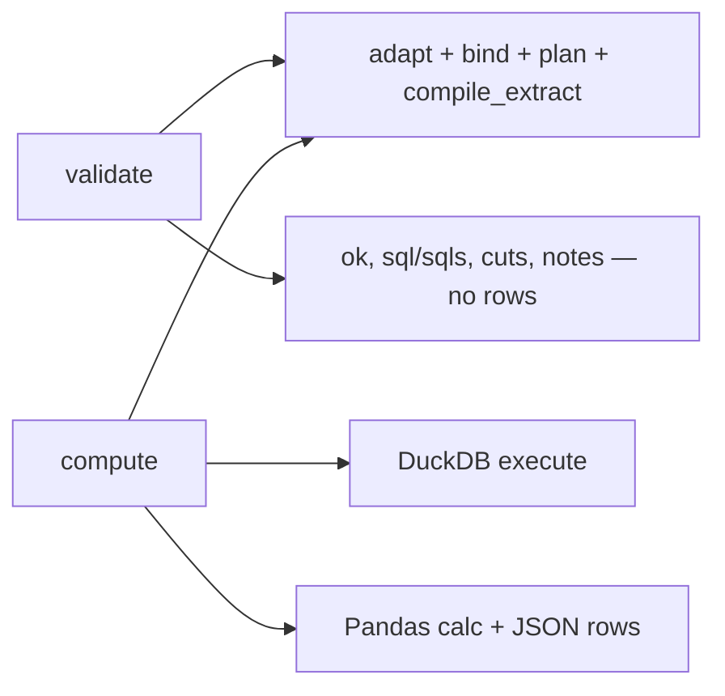

Use `validate` in CI / dry-run: SQL is compiled and logged, files are not scanned. `time.anchor: last_observed` cannot resolve `anchor` without data (`anchor: null` in the validate payload).

---

## 15. Worked path: KPI 3004 (Sotif)

YAML: `kpi_config/kpis/sotif/3004.yaml`, model `sotif`. Fact `amount` → `sotif_value` (`agg: sum`). Host asks for `current_value` and `yoy`.

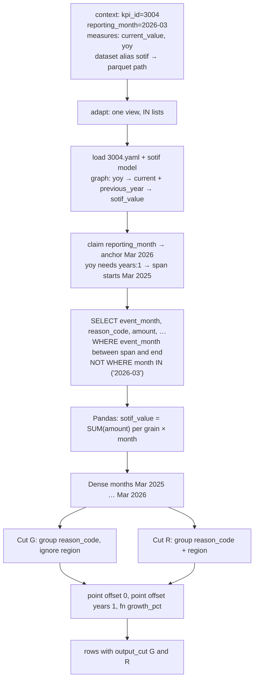

Host `selected_dimensions` picks from YAML `dimensions:` (GROUP BY). It is not a measure. Do not declare `parameters.selected_dimensions`.

---

## 16. Errors and logs

All failures subclass `KPIEngineError` (`exceptions.py`). Treat any of them as a failed request (do not retry blindly).

| Type | Typical cause |
|---|---|
| `ContextError` | Missing `kpi_id`, not exactly one view, bad `parameters` shape |
| `BindError` | Missing YAML, unknown `measure_key` / `op`, model alias not on context, identifier clash |
| `FilterError` | Unmapped valued filter, illegal operator |
| `TimePlanError` | Month filter not a single value, span cap, day grain without a full date |
| `CatalogError` | Unknown plugin at eval time, densify/trend cap, non-shiftable op at shifted anchor |

Each `compute` / `validate` writes `logs/kpi-compute-<kpi_id>-<timestamp>-<seq>.log` (or `$KPI_ENGINE_LOG_DIR`). The file traces adapt → bind → extract → calculate, the **full DuckDB SQL** (parameterized and inlined), and plugin invoke/return. Set `KPI_ENGINE_LOG=0` to disable.

---

## 17. Folder map (runtime)

```text
kpi_engine/
  main.py                 UDF pass-through → compute
  __init__.py             public compute / validate / list_capabilities
  host_runtime.py         acquire DuckDB (never close host session)
  runlog.py               per-request log file
  contracts.py            frozen dataclasses (KpiSpec, TimePlan, …)
  dates.py                calendar / fiscal truncate, offsets
  identifiers.py          fold names, parse expr, quote SQL idents
  pipeline/               frozen stages — do not add a catalog name here
  capabilities/           op / hook / function bodies
  registries/             allowlist YAML + generated CAPABILITIES.md

kpi_config/
  kpis/<group>/<kpi_id>.yaml
  models/<group>/<model_id>.yaml
```

What each file does at each step: **§19**. Scaling ops / hooks / functions: **§20–§21**.

---

## 18. Where to look when something fails

| Symptom | Start here |
|---|---|
| Wrong or missing `kpi_id` file | `binder._resolve_yaml`, filename = `kpi_id` exactly |
| Dataset / path | `binder.bind_datasets`, context `alias` vs model `required_aliases` |
| SQL missing history / one-month IN | `time_planner.plan_time`, `model_sql._assert_no_month_in` |
| Filter applied on G but not R | cut `ignore_filters` + `split_filters` (`calc` vs `extract`) |
| Wrong grain / extra region column | `cuts.effective_group_by`, `selected_dimensions` |
| Unknown `op` / `fn` | `registries/` then `loader.ensure_loaded` |
| Number disagrees with Excel | `compute_cuts` phase (combo vs cut); ratio-of-totals vs sum-of-ratios in `base_measures` |
| Empty rows, SQL looks fine | densify + `row_set`, unobserved anchor `notes` |
| Host connection closed | must not happen — only the test fallback in `host_runtime.acquire_connection` is owned |

Deploy **matching** `kpi_engine/` + `kpi_config/` together. Copy the package next to Hub `core/` (parent on `sys.path`). Set `KPI_ENGINE_CONFIG_DIR` if YAML is not the sibling `kpi_config/`.

---

## 19. File contribution at each step

The orchestrator calls other modules. It does not contain KPI math. Below, **contribution** means what that file *does for this request*, not every helper it exports.

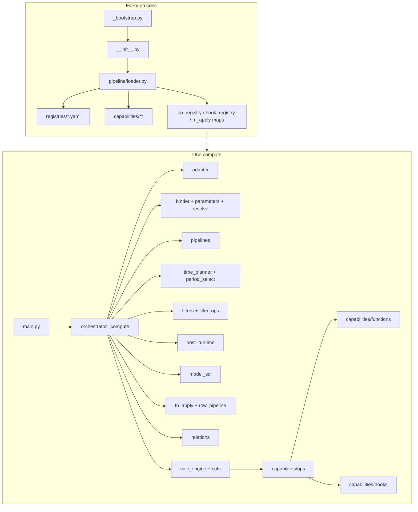

### 19.1 Process start (import, before any request)

| File | Contribution |
|---|---|
| `_bootstrap.py` | Put the **parent** of `kpi_engine/` on `sys.path`. Reject adding the package folder itself (would shadow Hub `core` / `pipeline`). |
| `__init__.py` | Public API: `compute`, `validate`, `list_capabilities`. Calls bootstrap + `ensure_loaded()`. |
| `pipeline/loader.py` | Read the four registry YAML files; `importlib` the `module`/`attr`; fill in-memory maps. Platform names must load; disabled add-ons are skipped. |
| `pipeline/op_registry.py` | `OP_KINDS` map: YAML `op:` name → `OpPlugin` instance. |
| `pipeline/hook_registry.py` | `REGISTRY` map: YAML `hook:` name → Python callable. `run(name, …)` is the only way the hook op invokes a body. |
| `pipeline/fn_apply.py` (maps only) | `COLUMN_FNS` / `MEASURE_FNS` filled by the loader. Bodies stay in `capabilities/functions/`. |
| `registries/ops.yaml`, `hooks.yaml`, `functions/column.yaml`, `functions/measure.yaml` | Closed allowlist. A name not listed here cannot bind. |
| `registries/CAPABILITIES.md` | Generated catalog (`write_generated_docs()`). Not executed. |
| `capabilities/__init__.py` | Marker: add logic here, not in `pipeline/`. |

### 19.2 Entry and envelope

| File | Step | Contribution |
|---|---|---|
| `main.py` | Host UDF | Pass-through to `compute`. No KPI branches. CLI: `python -m kpi_engine.main context.json`. |
| `pipeline/orchestrator.py` | Whole request | Owns **step order**, DuckDB session lifetime, JSON envelope, pagination, applied/ignored filter metadata. Calls every other stage. `validate()` stops after `compile_extract`. |
| `runlog.py` | Whole request | Opens `logs/kpi-compute-…`. Traces steps, SQL (parameterized + inlined), plugin invoke/return. `KPI_ENGINE_LOG=0` disables. |
| `host_runtime.py` | Extract | Resolve one DuckDB session. Never close a host connection. Tests may own a local `duckdb.connect()`. |
| `exceptions.py` | Any failure | `ContextError` / `BindError` / `FilterError` / `TimePlanError` / `CatalogError`. |
| `contracts.py` | All stages | Frozen dataclasses (`AdaptedRequest`, `KpiSpec`, `ModelSpec`, `TimePlan`, `OutputSpec`, `CutSpec`). No I/O. |
| `identifiers.py` | Bind + SQL + expr | Fold names (case/space/underscore), parse measure `expr:`, quote DuckDB identifiers, reserved words. |
| `dates.py` | Time + spine + ops | Truncate to grain, calendar/fiscal, offsets, period ranges, DuckDB parse SQL. |

### 19.3 Adapt (context JSON → `AdaptedRequest`)

| File | Contribution |
|---|---|
| `pipeline/adapter.py` | Require `execution.kpi_id` and exactly one view. Read `measures_required` / `measures_requested`. Normalize `value`/`values` to IN lists. Reject `heir`. Ignore `business_date`. Read `parameters`, `datasets`, pagination. Reject `execution.time_grain`. **Does not load YAML.** |

### 19.4 Bind (YAML → typed spec)

| File | Contribution |
|---|---|
| `pipeline/binder.py` | Find `kpis/<id>.yaml` (exact stem) and `models/<id>.yaml` (folded stem). Parse dimensions, bases, cuts, measures. `bind_datasets` maps aliases → paths. `resolve_requested_graph` walks requested keys to bases. `_parse_measure` asks `require_op(kind)` then `plugin.parse` / `plugin.validate`. Unknown `op` fails here, not at eval. |
| `pipeline/parameters.py` | Coerce `context.parameters` against YAML `parameters:`. Reserved: `time_grain`, `output_cut`. Overlay grain and locked cut **after** parse. |
| `pipeline/resolve.py` | Materialize `when:` / `from_param:` **before** `_parse_kpi`. Deepcopy no-op when those keys are absent (3004 identity). |
| `pipeline/compose.py` | Expand `time.compose.template` and filter compose strings from context keys. |
| `pipeline/op_protocol.py` | `OpPlugin` façade and `EvalCtx`. Binder and calc_engine talk to plugins only through this. Capabilities must not import `calc_engine`. |
| `pipeline/pipelines.py` | Split the request into one **Pipeline** per extract model, or one joined pipeline when a graph spans models (`model_relations`). Pick cuts for those keys (`cuts_for_keys`). |

Config files at this step: `kpi_config/kpis/…` (math) and `kpi_config/models/…` (retrieve). Neither file is executed as code.

### 19.5 Plan time and filters

| File | Contribution |
|---|---|
| `pipeline/time_planner.py` | Claim the month filter. Build `TimePlan` (anchor, `required_span`). Ask each requested measure’s plugin for `lookback` / `lookforward` so unrequested keys do not widen the scan. Snapshot KPIs skip the claim. |
| `pipeline/period_select.py` | Independent year/month/… parts. Month-name aliases (`March` / `Mar`). Selection bounds and period lists. |
| `pipeline/filters.py` | Map remaining filter codes to columns. Split `extract` / `calc` / `result`. Apply Pandas masks per cut (`ignore_filters`). Drop JSON rows after calc (`apply_result_filters`). |
| `pipeline/filter_ops.py` | Shared operators (`in`, `eq`, `between`, …) compiled to DuckDB SQL **and** Pandas masks so extract and calc agree. |

### 19.6 DuckDB retrieve

| File | Contribution |
|---|---|
| `pipeline/model_sql.py` | `compile_extract` / `extract`: `FROM` parquet or `delta_scan` (or wrap SQL CTE). `WHERE` source filters + **time range**. `SELECT` physical columns only. Assert the month is not `IN (one bucket)`. Period probe SQL for unbounded plans. |
| `pipeline/cuts.py` | `extract_grain` / `effective_group_by` / `emitted_cuts_from` (`also_emit` walk). Grain is data in YAML, not hardcoded G/R. |

### 19.7 Pandas facts, fold, spine

| File | Contribution |
|---|---|
| `pipeline/fn_apply.py` | `fold_extract_columns`, `apply_dimension_maps`, `apply_pandas_facts` (column `op:`, `sql:` copy, `expr:`), `collapse_pandas_detail` (`agg:` including non-additive re-read), `call_measure_fn`. |
| `pipeline/row_pipeline.py` | Topo-order row helpers: `lookup:`, `over:`, helper `expr:` without `agg:`. Caps on partition / row count. |
| `pipeline/relations.py` | After each model is folded: join monthly frames on `model_relations`. |
| `pipeline/calc_engine.py` (`densify`) | Cross product of combos × periods so shifts move by calendar. 50,000-cell cap. |

### 19.8 Calculate measures (dispatch)

| File | Contribution |
|---|---|
| `pipeline/calc_engine.py` | `compute_cuts`: per cut, mask, combos, `evaluate` (combo phase), `apply_to_cut` (cut phase), cut-derived arithmetic, `having:`. Memo on `(measure_key, anchor, selection)`. |
| `pipeline/predicates.py` | Evaluate `having:` / `op: predicate` lists on a finished row. |
| `capabilities/ops/combo.py` | Combo-phase kinds: `point`, `window`, `trend`, `arithmetic`, `fn`, `expr`, `constant`, `dimension`, `hook`, `predicate`. |
| `capabilities/ops/period.py` | Combo-phase period/compare: `lag`, `lead`, `index`, `diff`, `pct_change`, `vs_target`, `threshold`. |
| `capabilities/ops/cut.py` | Cut-phase kinds: `rank`, `percent_of_total`, `ntile`, `dense_rank`, `gap_to_leader`, … |
| `capabilities/ops/support.py` | Shared helpers (`window_bounds`, `require_base_of`, densify fact columns). Plugins import this, not `calc_engine`. |
| `capabilities/functions/column/impl.py` | Bodies for `base_measures` `columns:` + `op:` (row-wise Series). |
| `capabilities/functions/measure/impl.py` | Bodies for `op: fn` / `arithmetic` (scalars already aggregated). |
| `capabilities/hooks/impl.py` | Bodies for `op: hook` (aligned series + `kpi` / `plan` / `spec`). |

### 19.9 JSON out

Still `orchestrator.py`: result filters, `_stamp_green`, sort, paginate, stamp dimension roles, wrap timed measures, attach `sql`/`sqls`, filter metadata, `trend_axes`, `notes`.

---

## 20. Main scaling decision: freeze the pipeline, grow the catalog

The architecture that lets the system scale is **not** “add a Python file per KPI.” It is this split:

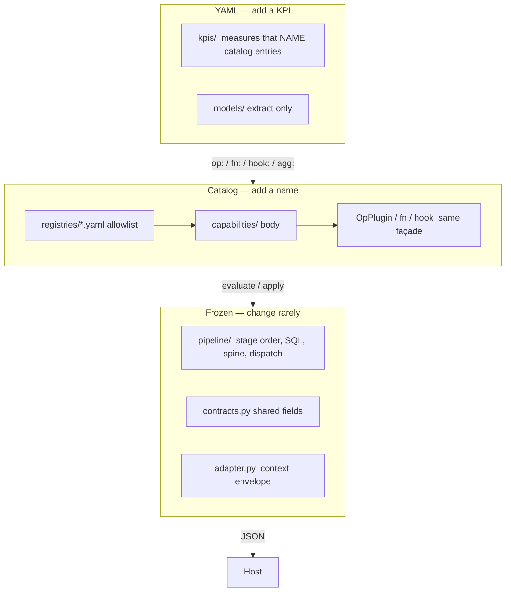

**Locked rule:** `execution.kpi_id` selects a YAML file. The engine never does `if kpi_id == 3004`. A new reusable **name** is two folders (`capabilities/` + `registries/`), not `pipeline/`. KPI authors compose names that already exist.

That is why onboarding is cheap at three different scales:

| Scale | What you add | Engine Python | Example |
|---|---|---|---|
| 1. New KPI | `kpi_config/kpis/…yaml` (reuse model) | None | Same SUM + YoY + 12m trend, new `kpi_id` |
| 2. New extract | `kpi_config/models/…yaml` + KPI YAML | None | New fact table / CTE |
| 3. New catalog name | Body + one registry row | None in `pipeline/` | New `op`, hook, or function |
| 4. New engine primitive | `pipeline/` (+ maybe `contracts.py`) | Yes | New `agg:`, filter operator, compose template, time format, *common* measure field (`offset`-like) |

Tiers 1–3 are how the system is meant to grow. Tier 4 is rare and is an architecture change, not onboarding.

```text
Need a calculation?
  ├─ Catalog already has the name?     → KPI YAML only (tier 1–2)
  ├─ Same math, new tables?            → model YAML + KPI YAML
  ├─ New reusable behavior?            → capabilities + registries (tier 3)
  ├─ One-off algorithm, aligned series?→ hook (still tier 3)
  └─ New primitive the façade cannot express? → pipeline/ (tier 4)
```

### Why this scales

1. **Closed-world names.** Binder calls `require_op(kind)`. If the string is not in `registries/ops.yaml` (enabled), bind fails with the registered list. No silent `eval`, no dotted import from YAML.
2. **One façade.** Every measure kind is an `OpPlugin` (`parse`, `validate`, `dependencies`, `lookback` / `lookforward`, `evaluate` and/or `apply_to_cut`). The frozen dispatcher does not grow a `if kind ==` chain when you add `rolling_foo`.
3. **Lookback is a plugin method.** `time_planner` asks the plugin how many grain periods to scan. A new window-like op widens DuckDB without editing the planner.
4. **Hooks are not import paths.** YAML says `hook: ewma`. The loader bound that string to `capabilities.hooks.impl.ewma`. Authors cannot point at arbitrary modules.
5. **Functions are maps, not YAML Python.** Column fns run on Series before fold; measure fns run on scalars after fold. Same loader pattern.
6. **Add-ons vs platform.** `role: platform` must load or the process fails. `role: addon` can be `enabled: false` without taking down the engine.
7. **Family files, not one file per name.** Ops live in `combo.py` / `period.py` / `cut.py`. Split a file when it is hard to review — never `ops/my_kpi_3004.py`.

### What does *not* scale this way

These stay engine work because they are not names on the `OpPlugin` façade:

| Change | Why pipeline |
|---|---|
| New `agg:` (`geomean`, …) | Fold lives in `fn_apply` / contracts `AggName` |
| New filter operator (`like`, `regex`) | `filter_ops.py` + SQL and Pandas must match |
| New grain or time format | `dates.py`, `time_planner.py` |
| New *common* measure field (shared by every op) | `CommonMeasureFields` + binder extract |
| New registry extra key (`min_args`, `requires_value`, `extra_keys`) | `loader._EXTRAS_ALLOWED` (rare one-liner) |
| Context JSON shape | `adapter.py` |
| DuckDB scan type | `model_sql.py` |

Do not fake those with `op: expr` or a per-KPI hook that scans ADLS. Hooks receive **already aggregated / aligned** frames.

---

## 21. How to onboard a new op, hook, or function

Check [CAPABILITIES.md](kpi_engine/registries/CAPABILITIES.md) first. The name may already exist (`rolling_median` is an alias of `period_median`).

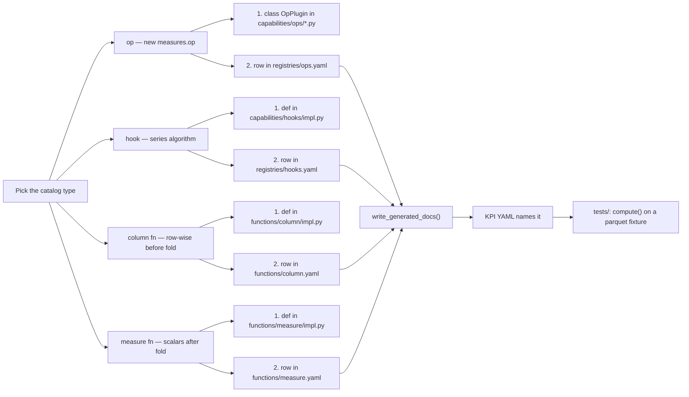

### 21.1 New measure op (`measures.op: my_kind`)

**When:** the behavior is a new *kind* of calculation (new time semantics, new cut ranking rule, new composition), not a named formula on existing kinds.

**Files (only these):**

1. Add a class in the right family file:
   - Combo (one group’s series → one number or trend array): `capabilities/ops/combo.py`
   - Period shift/compare: `capabilities/ops/period.py`
   - Needs the full cut (rank, share): `capabilities/ops/cut.py`
2. Register in `registries/ops.yaml`:

```yaml
my_kind:
  role: addon          # platform only for kinds every KPI depends on
  enabled: true
  aliases: []
  description: One sentence for CAPABILITIES.md.
  example: |
    my_measure:
      op: my_kind
      of: fact
  module: kpi_engine.capabilities.ops.combo   # must start with kpi_engine.capabilities.
  attr: MyKind                                # class name
```

3. Implement `OpPlugin` as needed:

| Method | When it runs | You must |
|---|---|---|
| `parse` | Bind | Read extra YAML keys (`extra_keys`). Default handles `of`, `offset`, `trailing`, `range`. |
| `validate` | Bind | Reject illegal `of:` / snapshot / helper combos. |
| `dependencies` | Bind graph | Other measure keys this op reads. |
| `lookback` / `lookforward` | Time plan | Grain periods to scan. Default 0. |
| `evaluate` | Combo phase | Return a scalar or `(axis, values)` if `emits_trend`. |
| `source_for_cut` + `apply_to_cut` | Cut phase | If `phase = "cut"`. |
| `shiftable = True` | Lag of this op | Allow evaluate at a shifted anchor. |

Set `phase`, `cut_restricted`, `requires_time`, `emits_trend`, `echo_dimension` as class attributes. Import helpers from `capabilities.ops.support`, not from `calc_engine`.

4. Regenerate the catalog:

```python
from kpi_engine.pipeline.loader import write_generated_docs
write_generated_docs()
```

5. Use it from any KPI YAML (`op: my_kind`). Add a `compute()` test under `tests/`.

**Do not change:** `pipeline/`, `main.py`, `contracts.py` (unless you need a new *shared* field), or add `kpi_engine/ops/my_kind.py` as a one-name file.

### 21.2 New hook (`op: hook`, `hook: my_hook`)

**When:** an algorithm on an aligned period series that you do not want as a first-class kind yet (EWMA, CAGR, MAD, projection). If a second KPI needs the same logic as a *kind*, promote it to an op (21.1).

**Files:**

1. Function in `capabilities/hooks/impl.py` — signature is flexible; the hook op passes `series`, `kpi`, `plan`, `spec`. Must not scan ADLS.
2. Row in `registries/hooks.yaml` (`module` / `attr`, `description`, `example`). Optional `requires_value`, `extra_keys`.
3. KPI YAML **must** set `trailing:` or `offset:` so the planner scans enough history.
4. `write_generated_docs()` + a `compute()` test.

YAML:

```yaml
smoothed:
  op: hook
  hook: ewma
  of: sotif_value
  trailing: { months: 12 }
```

### 21.3 New column function (`base_measures` `columns:` + `op:`)

**When:** row-wise math **before** `agg:` (absolute value, divide two physical columns, `if_else`).

**Files:** `capabilities/functions/column/impl.py` (takes `pd.Series`, returns `pd.Series`) + `registries/functions/column.yaml`. Variadic fns set `min_args`. Then `write_generated_docs()`.

### 21.4 New measure function (`op: fn` / `arithmetic`)

**When:** scalar math **after** aggregation (`growth_pct`, `divide`, `clamp`). Prefer `op: fn` + `inputs:` when argument order must not swap.

**Files:** `capabilities/functions/measure/impl.py` (scalars; any null → null; divide-by-zero → null) + `registries/functions/measure.yaml`. Then `write_generated_docs()`.

### 21.5 Ease of onboarding (what “easy” means)

| Task | Files touched | Bind on next `compute`? |
|---|---|---|
| New KPI from existing names | 1 YAML (maybe 1 model) | Yes — no deploy of new Python if engine already shipped those names |
| New op / hook / fn | 2 files (body + registry) + generated MD + a test | Yes, after that engine build is deployed with `kpi_config` |
| New `agg` or filter op | `pipeline/` + tests | Architecture change; do not treat as catalog onboarding |

Deploy **matching** engine + YAML: a KPI that names `op: my_kind` fails bind on a host whose `registries/ops.yaml` does not list it.

Local check after a registry change: `pytest tests/test_capability_registries.py tests/test_addon_ops.py` plus a focused `compute()` test for the new name.
